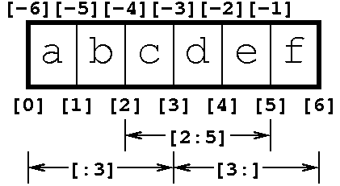

# Week 1: Python Fundamentals - Study Guide

## Table of Contents
1. [Introduction to Python](#introduction-to-python)
2. [Import and Modules](#import-and-modules)
3. [Compound Data Structures](#compound-data-structures)
4. [The Substitution Model and Environment Model](#the-substitution-model-and-environment-model)
5. [Python Functions](#python-functions)
6. [Python Programming FAQ](#python-programming-faq)
7. [Histograms Example](#histograms-example)
8. [Practice Exercises](#practice-exercises)
9. [Quick Reference](#quick-reference)

---

## Introduction to Python

### Why Python?

- **Multiple programming styles:** Supports procedural, object-oriented, and functional programming
- **Interactive:** Immediate feedback through interpreters and notebooks
- **Popular in AI research:** Widely used in machine learning and data science
- **Easy and fun:** Many tasks that are cumbersome in other languages become simple

> "I started using Python around 2004, and my experience was a lot like the guy in this comic. A lot of things that seemed to be a hassle when I had to do them in C just disappeared, so programming became a lot faster and more fun."

Python was created by Guido Van Rossum in 1991.

### Installing Python

Use the **Anaconda distribution** from https://www.anaconda.com/distribution/
- Choose the latest Python 3 version
- Includes many useful libraries pre-installed
- Works on Windows, macOS, and Linux

### Ways of Running Python

| Method | Description | Use Case |
|--------|-------------|----------|
| `python` | Old-school interactive interface (prompt: `>>>`) | Quick testing |
| `ipython` | Better interactive interface (prompt: `In [1]:`) | Interactive exploration |
| Text editor + `.py` | Write code in files, run with `python myprogram.py` | Full programs |
| **Spyder** | IDE combining interaction and file editing | Development |
| **Jupyter Notebook** | Mix code, results, graphs, and documentation | Learning, presentations, data science |

**Important distinctions:**
- Don't run Python from inside Python: ❌ `>>> python myprogram.py`
- Don't use Python commands from the shell: ❌ `$ import math`

### Example: Newton's Method for Square Roots

```python
def newton(a, x0, tol=10**-8):
    """Newton's method for finding square roots."""
    x = x0  # initial value
    while True:  # forever
        print(x)
        y = (x + a/x) / 2  # update y
        if abs(x - y) < tol:  # x and y arbitrarily close
            break  # exit the infinite loop
        x = y  # update x
    return x

newton(64, 1)
```

### Basic Types

| Type | Example | Notes |
|------|---------|-------|
| `bool` | `True`, `False` | Boolean values |
| `int` | `42`, `-17` | No special `long` or `unsigned` |
| `float` | `3.14`, `2.0` | No separate `double` type |
| `str` | `"hello"`, `'world'` | No separate `char` type |

### Everything is an Object

Everything in Python is an object, even primitive types like integers:

```python
x = 3
type(x)  # <class 'int'>
x.bit_length()  # 2
dir(x)  # list all methods
```

### Operators

**Arithmetic:** `+`, `-`, `*`, `/`, `%`, `**` (power), `//` (integer division)

**Assignment:** `=`, `+=`, `-=`, `*=`, `/=`, `%=`

**Comparison:** `==`, `<`, `<=`, `>`, `>=`, `!=`

**Example:**
```python
365 * 24 * 60 * 60 > 1000 * 12  # True
```

### Strings

```python
s = "abc"  # or 'abc'
s = 'abc"xyz'  # mixing quotes
s.startswith("ab")  # True
s.upper()  # "ABC"
s.lower()  # "abc"
```

**Useful string methods:**
- `startswith`, `endswith`
- `upper`, `lower`
- `find`, `count`
- `join`, `split`
- `replace`

**Documentation:** https://docs.python.org/3/library/stdtypes.html#string-methods

### Conditionals

```python
if a > 3:
    print("a")
elif b > 3:
    print("b")
else:
    print("c")
```

### Loops

**While loop:**
```python
n = 3
while n > 1:
    if n % 2 == 0:
        n = n // 2
    else:
        n = 3 * n + 1
    print(n)
```

---

## Import and Modules

### "Batteries Included" Philosophy

Python comes with a comprehensive standard library. Third-party libraries like NumPy and Pandas extend functionality even further.

### Using Modules

Before using a library, you must **import** it:

```python
import math
print(math.sqrt(64))  # 8.0
print(math.sin(2 * math.pi * 0.5))  # 1.0
print(math.floor(2.5))  # 2
print(math.log(math.e**16))  # 16.0
```

❌ **Won't work without import:**
```python
sin(3.0)  # NameError
```

### Forms of Import

```python
import math                          # Standard import
from math import sin                 # Import specific function
from math import cos, sin            # Import multiple
from math import sqrt as my_func     # Import with alias
from math import *                   # Import everything (discouraged)
```

**Why avoid `from math import *`?**
It "pollutes" the namespace - you don't know where functions come from.

### Writing Your Own Modules

Save code in a `.py` file, then import it:

**File: `newton.py`**
```python
def newton(a, x0, tol=10**-8):
    """Newton's method for finding square roots."""
    x = x0
    while True:
        y = (x + a/x) / 2
        if abs(x - y) < tol:
            break
        x = y
    return x

if __name__ == "__main__":  # Only run if executing directly
    newton(64, 5)
```

**Using the module:**
```python
import newton
newton.newton(10, 5)
```

### Recommended Resources

- **Python Module of the Week:** https://pymotw.com/3/
- **Official Python Docs:** https://docs.python.org/3/

---

## Compound Data Structures

Four essential compound types:
1. **`list`** - Ordered, mutable collection
2. **`tuple`** - Ordered, immutable collection
3. **`set`** - Unordered, no duplicates
4. **`dict`** - Key-value pairs

### Lists

**Creating lists:**
```python
primes = [2, 3, 5, 7, 11]
names = ["John", "Paul", "George", "Ringo"]
mixed = ["a", "b", 3, [1, 2, 3]]  # Mixed types OK
```

**Common operations:**
```python
names.append("Fred")       # Add to end
names.remove("Fred")       # Remove by value
names.index("Paul")        # Find index (returns 1)
names.sort()              # Sort in place
del names[2]              # Delete by index
len(names)                # Get length
```

**Joining lists:**
```python
x = [3, 4, 5] + [9, 10, 11]  # [3, 4, 5, 9, 10, 11]
```

### For Loops

Iterate over any sequence:

```python
for x in names:
    print(x)

for x in range(5):  # 0, 1, 2, 3, 4
    print(x)
```

**Common pattern - building a list:**
```python
def cumulative_sum(L):
    s = 0
    result = []
    for x in L:
        s += x
        result.append(s)
    return result

cumulative_sum([1, 2, 3])  # [1, 3, 6]
```

### Useful Functions with For Loops

**`zip` - combine lists:**
```python
for name, instrument in zip(
    ["John", "Paul", "George", "Ringo"], 
    ["guitar", "bass", "guitar", "drums"]
):
    print(name, instrument)
```

**`enumerate` - get index and value:**
```python
for i, name in enumerate(names):
    print(i, name)
```

**Three-way zip with destructuring:**
```python
n1 = ["John", "Paul", "George", "Ringo"]
n2 = ["Lennon", "McCartney", "Harrison", "Starr"]
inst = ["guitar", "bass", "guitar", "drums"]

for i, (first, last, instrument) in enumerate(zip(n1, n2, inst)):
    print(f"{i}: {first} {last}, {instrument}")
```

### Tuples

Like lists but **immutable** (cannot be changed):

```python
t = (4, 5, 6)
t[0] = 17  # TypeError!

# Convert to list to modify
t = list(t)
t[0] = 17  # OK now
```

**Use cases:**
- **Tuples:** Database rows (different types per field)
- **Lists:** Database columns (same type, homogeneous data)

### Indexing and Slicing

**Indexing:**
```python
L = [5, 6, 7]
L[0]   # 5 (first element)
L[1]   # 6
L[-1]  # 7 (last element)
L[-2]  # 6 (second to last)
```

**Slicing:**
```python
s = "abcdefgh"
s[1:4]   # "bcd"
s[:3]    # "abc" (from start)
s[5:]    # "fgh" (to end)
s[:]     # "abcdefgh" (whole thing)
```



**Think of indices as pointing "between" elements.**

### The `in` Operator

Check membership:

```python
5 in [3, 4, 5, 6]  # True
"ph" in "xylophone"  # True
```

### Sets

Unordered collection with no duplicates:

```python
s = {6, 5, 10}
s.add(6)    # No effect (already exists)
s.add(12)   # Added
5 in s      # True (fast lookup!)
```

### Dictionaries

Key-value pairs (like a hash map):

```python
d = {"name": "Bob"}
d["name"] = "Fred"
d["age"] = 37
print(d)  # {"name": "Fred", "age": 37}

print(d["age"])      # 37
print("name" in d)   # True (checks keys)
print("Fred" in d)   # False (doesn't check values)
```

**Important:** `in` only checks keys, not values!

### Nested Data Structures

Example: Student records database

```python
students = [
    {
        "name": "Bruce Wayne", 
        "age": 34,
        "ID": "1234",
        "modules": {
            "CT5123": {
                "grades": [55, 68],
                "attendance": [False, True, True, True, True],
            },
            "CT5234": {
                "grades": [45, 90],
                "attendance": [True, False, False, False, True]
            }
        }
    },
    # More students...
]
```

**Accessing nested data:**
```python
students[0]["name"]                        # "Bruce Wayne"
students[1]["modules"]["CT5123"]["attendance"]  # Parker's CT5123 attendance
students[0]["modules"]["CT5234"]["grades"][-1]  # Wayne's most recent CT5234 grade
```

### Mutability

**Mutable:** Can be changed - `list`, `set`, `dict`
**Immutable:** Cannot be changed - `str`, `tuple`, `int`, `float`, `bool`

**Why it matters:**

1. **Confusing behavior:**
```python
L = [1, 2, 3]
M = L        # M points to same object!
L[0] = 17
print(M)     # [17, 2, 3] - M changed too!
```

2. **Only immutable objects can be dict keys:**
```python
d = {}
L = [1, 2, 3]
d[L] = "abc"     # TypeError! Lists not hashable

t = (1, 2, 3)
d[t] = "abc"     # OK - tuples are immutable
```

---

## The Substitution Model and Environment Model

### The Substitution Model

**How does Python evaluate complex expressions?**

**From the inside out.**

Just like in mathematics:

```
math.sin(math.sqrt(x+12))
= math.sin(math.sqrt(16))    (if x=4)
= math.sin(4.0)              (sqrt(16)=4.0)
= -0.7568...                 (sin(4) ≈ -0.7568)
```

### Example: Nested List Access

```python
M = [
    [0, 1, 2, 3],
    [4, 5, 6, 7],
    [8, 9, 10, 11]
]

print(M[1][2])
```

**Apply substitution model:**
```python
M[1][2]
= [4, 5, 6, 7][2]  # M[1] evaluates first
= 6                # Then [2]
```

**Why `M[1]` before `[2]`?**
Operator precedence: `[]` binds left-to-right.

### Namespaces

A **namespace** is an environment mapping names to values.

Think of it as a dictionary:
```python
f_namespace = {"x": 2, "y": 3}
```

**Types of namespaces:**
- **Global namespace:** Created when program starts
- **Local namespace:** Created when function is called
- **Object namespace:** Created with objects/modules

### Scope

Names are accessible from **outer to inner** (nested) frames, but **not the reverse**.

```python
z = 4
def f(x):
    y = 3
    return x + y + z  # z is in scope!

f(2)  # Returns 9
print(y)  # NameError! y is NOT in scope
```

**Why scope matters:**
- Prevents name collisions
- Allows code reuse
- Essential for large programs

### How to Call a Function

1. **Evaluate the arguments** passed in
2. **Create a new namespace** with parameter names → argument values
3. **Run the function body**
4. Look up names: **local first, then enclosing** (recursively if needed)
5. **Return a value** and substitute it
6. **Delete the local namespace**

### Example: Detailed Evaluation

```python
def f(x):
    return x[1] > 0

print(19 if f([-2, -3, -4, -2]) else 18)
```

**Step-by-step:**
1. Create list `[-2, -3, -4, -2]`
2. Call `f`, create namespace: `x: [-2, -3, -4, -2]`
3. Evaluate `x[1] > 0` → `-3 > 0` → `False`
4. Return to outer scope: `19 if False else 18`
5. Result: `18`

### Ternary Expression

Python's conditional expression:
```python
result = value_if_true if condition else value_if_false
```

Equivalent to Java/C: `condition ? value_if_true : value_if_false`

### Mental Simulation

Core programming skill: "being the interpreter"

**Key concepts:**
1. Substitution model (like arithmetic)
2. Environment model (namespaces and scope)
3. Operator precedence (use parentheses when in doubt)
4. Implicit state (e.g., in for-loops)

---

## Python Functions

### Default Parameters and Keyword Arguments

```python
def greet(name, greeting="Hello"):
    print(f"{greeting}, {name}")

greet("James", greeting="Hi")  # Hi, James
greet("James")                  # Hello, James
```

**Multiple keyword arguments:**
```python
def greet(name, greeting="Hello", exclamation="."):
    print(f"{greeting}, {name}{exclamation}")

# Can pass in any order (after positional args)
greet("James", exclamation="!!", greeting="Hi")
```

### None

Functions without explicit `return` return `None`:

```python
x = greet("James")
print(x)  # None
type(x)   # <class 'NoneType'>
```

### Returning Multiple Values

Functions can return multiple values (actually a tuple):

```python
def max_argmax(L):
    maxv = -float("inf")
    maxi = -1
    for i, x in enumerate(L):
        if x > maxv:
            maxv = x
            maxi = i
    return maxv, maxi

result = max_argmax([4, 5, 6])
print(type(result))  # <class 'tuple'>

# Unpack directly
max_val, max_idx = max_argmax([5, 6, 7, 10, 3, 4, 9])
print(max_val, max_idx)  # 10, 3
```

### Lambda Expressions

Anonymous functions for small, inline operations:

```python
# Lambda syntax
lambda x: x**2

# Equivalent to:
def sq(x):
    return x**2
```

**Common use: sorting with custom key:**
```python
words = ["apple", "pie", "zoo", "a"]
sorted(words, key=lambda x: len(x))  # Sort by length
```

**Direct invocation (uncommon but possible):**
```python
(lambda x: x**2)(4)  # Returns 16
```

### Call-by-Value vs Call-by-Reference

**Immutable objects (int, float, str, tuple):** Call-by-value

```python
def f(x):
    x += 1
    print(x)

a = 3
f(a)    # Prints 4
print(a)  # Still 3
```

**Mutable objects (list, dict, user objects):** Call-by-reference

```python
def f(L):
    L.append(1)
    print("L", L)

M = [4, 5, 6]
f(M)      # L [4, 5, 6, 1]
print("M", M)  # M [4, 5, 6, 1] - changed!
```

**Better approach - return new value:**
```python
def f(x):
    x += 1
    return x

a = 3
a = f(a)  # Explicitly update
print(a)  # 4
```

### Copying Lists

**Assignment doesn't copy:**
```python
L = [4, 5, 6]
M = L         # M points to same object!
M.append(7)
print(L)      # [4, 5, 6, 7] - changed!
```

**Make a true copy:**
```python
L = [4, 5, 6]
M = list(L)   # Creates new list
M.append(7)
print(L)      # [4, 5, 6] - unchanged
print(M)      # [4, 5, 6, 7]
```

---

## Python Programming FAQ

### Why Did the Computer Do That?

> "Don't anthropomorphize computers. They hate that!"

Computers are deterministic. They do exactly what you tell them. If the output is wrong, the instructions were wrong.

### What is an Algorithm?

An **algorithm** is a sequence of definite steps producing a result (like a recipe).

A **program** is a concrete implementation of an algorithm.

**Pseudo-code:** Semi-formal language for describing algorithms without syntax details.

### What Do I Do When I'm Stuck?

1. **Incremental development:** Start small, add gradually
2. **Debug with print statements** or use IDE debugger
3. **Try things:** Experiment and observe
4. **Read error messages carefully**
5. **Search online** for similar problems

### Good Python Style

**Comments:**
```python
# This is a comment
x = 3  # Comment after code
```

**Good variable names:**
```python
# Good
name = "James"
job = "lecturer"
n_users = 100

# Bad
xyz = "James"
my_var_13 = "lecturer"
```

**Naming conventions:**
- **Variables/functions:** `lowercase_with_underscores`
- **Classes:** `CamelCase`
- **Counts:** `n_items` (preferred) or `item_cnt`

**When to use short names:**
```python
def all_positive(L):
    for x in L:  # 'x' is fine - generic
        if x < 0:
            return False
    return True
```

**Resources:**
- **PEP 8:** Official Python style guide
- **Read Python code:** Best way to learn style

### What is the Benefit of Functions?

**Abstraction:** Manage complexity by breaking problems into smaller pieces.

Functions:
- Do one job well
- Hide implementation details
- Enable code reuse
- Make code more maintainable

"No matter what type of program we're writing, we're taking advantage of some abstractions provided by someone else."

### Common Error Types

| Error | Meaning | Common Causes |
|-------|---------|---------------|
| `SyntaxError` | Language rule violated | Wrong brackets, missing colons |
| `NameError` | Variable/function doesn't exist | Typo, forgot to import |
| `TypeError` | Wrong type for operation | Modifying immutable, wrong # args |
| `KeyError` | Dict key doesn't exist | Typo, wrong key type |
| `IndexError` | List index out of range | Accessing element beyond length |
| `AttributeError` | Object attribute doesn't exist | Typo in method name, wrong object |

---

## Histograms Example

### What is a Histogram?

A histogram represents **frequency of occurrence** for categories:
- **Continuous data:** Bins like [0, 10], [10, 20]
- **Discrete data:** Actual values like A, B, C

Histogram = underlying data structure, not just the graph.

### Basic Implementation

```python
def histogram(s):
    h = {}  # Represent histogram as a dict
    for c in s:
        if c in h:
            h[c] += 1  # Increment
        else:
            h[c] = 1   # Create key
    return h

histogram([31, 28, 31, 30, 31, 30, 31, 31, 30, 31, 30, 31])
# {31: 7, 28: 1, 30: 4}
```

### Duck Typing

"If it looks like a duck, walks like a duck, and quacks like a duck, treat it like a duck."

Our `histogram` works with **any iterable**:

```python
histogram("mississippi")
# {'m': 1, 'i': 4, 's': 4, 'p': 2}
```

### Using `defaultdict`

Avoid the `if-else` pattern:

```python
from collections import defaultdict

def histogram(s):
    h = defaultdict(int)  # int() returns 0
    for c in s:
        h[c] += 1
    return h
```

### Canonicalization

Map different forms to a single "canonical" form:

```python
def histogram(s, canonicalise=None):
    h = defaultdict(int)
    for c in s:
        if canonicalise:
            c = canonicalise(c)
        h[c] += 1
    return h

def canonicalise_case(s):
    return s.lower()

histogram("It was the BEST", canonicalise=canonicalise_case)
```

**Benefits:**
- Maintains generality
- Composable ("lego-like")
- Can use with any canonicalization function

**Example - round numbers:**
```python
histogram([17.3, 17.4, 19.1, 19.2], canonicalise=round)
# {17: 2, 19: 2}
```

### Normalization

Convert counts to frequencies (sum = 1):

```python
def histogram(s, normalise=False, canonicalise=None):
    h = defaultdict(int)
    for c in s:
        if canonicalise:
            c = canonicalise(c)
        h[c] += 1
    
    if normalise:
        total = len(s)
        for c in h:
            h[c] /= total
    return h

histogram("mississippi", normalise=True)
# {'m': 0.09, 'i': 0.36, 's': 0.36, 'p': 0.18}
```

### Sampling from a Histogram

Choose a key with probability weighted by frequency:

```python
import random

def hist_sample(h):
    # Assumes h is normalized (sum = 1)
    r = random.random()  # [0, 1]
    accum = 0
    for c in h:
        accum += h[c]
        if accum >= r:
            return c

h = histogram("mississippi", normalise=True)
for i in range(10):
    print(hist_sample(h), end=" ")
```

### File I/O

**Reading a file:**
```python
fname = "data/tale.txt"
s = open(fname, encoding="utf8").read()

# Or line by line:
f = open(fname)
for line in f:
    # process line
```

**Writing to a file:**
```python
g = open("output.txt", "w")
for i in range(100):
    g.write("some text\n")
g.close()
```

---

## Practice Exercises

### Exercise 1: Hailstones Sequence

Write a function that prints the Hailstones sequence starting from `n`:
- If even: divide by 2
- If odd: multiply by 3 and add 1
- Stop when reaching 1

```python
def hailstones(n):
    print(n)
    while n > 1:
        if n % 2 == 0:
            n = n // 2
        else:
            n = 3 * n + 1
        print(n)

hailstones(10)
```

<details>
<summary>Solution</summary>

```python
def hailstones(n):
    print(n)
    while n > 1:
        if n % 2 == 0:
            n = n // 2
        else:
            n = 3 * n + 1
        print(n)

hailstones(10)
# Output: 10, 5, 16, 8, 4, 2, 1
```

</details>

---

### Exercise 2: Is Palindrome

Write a recursive function to check if a string is a palindrome:

```python
def is_palindrome(s):
    """
    >>> is_palindrome('racecar')
    True
    >>> is_palindrome('hello')
    False
    >>> is_palindrome('amanaplanacanalpanama')
    True
    """
    # YOUR CODE HERE
```

<details>
<summary>Solution</summary>

```python
def is_palindrome(s):
    if len(s) <= 1:
        return True
    elif s[0] != s[-1]:
        return False
    else:
        return is_palindrome(s[1:-1])

# Test
import doctest
doctest.run_docstring_examples(is_palindrome, globals())
```

**Logic:**
1. Base case: empty or 1-char strings are palindromes
2. Check if first and last characters match
3. Recursively check the middle portion

</details>

---

### Exercise 3: Grid Driving - Simulate

Write a function that simulates a car driving in a grid:
- Grid is `xsize` × `ysize`
- Car starts at (0, 0)
- Program is a string of directions: "N", "S", "E", "W"
- Return (junctions visited, time-steps used)

```python
def simulate(prog, xsize, ysize):
    """
    >>> simulate("NNN", 100, 100)
    (4, 3)
    >>> simulate("NNNESSS", 100, 100)
    (8, 7)
    """
    # YOUR CODE HERE
```

<details>
<summary>Solution</summary>

```python
def simulate(prog, xsize, ysize):
    x, y = 0, 0
    visited = set()
    visited.add((x, y))
    steps = 0
    
    for s in prog:
        if s == "N":
            if y + 1 <= ysize - 1:
                y += 1
                steps += 1
        elif s == "S":
            if y - 1 >= 0:
                y -= 1
                steps += 1
        elif s == "E":
            if x + 1 <= xsize - 1:
                x += 1
                steps += 1
        elif s == "W":
            if x - 1 >= 0:
                x -= 1
                steps += 1
        
        visited.add((x, y))
    
    return len(visited), steps
```

**Key insights:**
- Use a `set` to track visited positions (automatically handles duplicates)
- Store positions as tuples (immutable, can be added to sets)
- Only increment steps when actually moving

</details>

---

### Exercise 4: Grid Driving - Plan

Write a function that generates an optimal program to visit all junctions:

```python
def plan(xsize, ysize):
    """
    >>> plan(2, 2)
    'NES'
    >>> plan(2, 3)
    'NNESS'
    >>> simulate(plan(10, 10), 10, 10)
    (100, 99)
    """
    # YOUR CODE HERE
```

<details>
<summary>Solution</summary>

```python
def plan(xsize, ysize):
    s = []
    
    for i in range(xsize):
        # Go north or south
        for j in range(ysize - 1):
            if i % 2 == 0:
                s.append("N")
            else:
                s.append("S")
        
        # Move east (except on last column)
        if i < xsize - 1:
            s.append("E")
    
    return "".join(s)
```

**Strategy:**
- Traverse columns in a zigzag pattern
- Even columns: go north
- Odd columns: go south
- Move east between columns
- Visits all n×m junctions in n×m-1 steps (optimal!)

</details>

---

### Exercise 5: Cumulative Sum

Write a function that returns the cumulative sum of a list:

```python
def cumulative_sum(L):
    """
    >>> cumulative_sum([1, 2, 3])
    [1, 3, 6]
    >>> cumulative_sum([5, 10, 15])
    [5, 15, 30]
    """
    # YOUR CODE HERE
```

<details>
<summary>Solution</summary>

```python
def cumulative_sum(L):
    s = 0
    result = []
    for x in L:
        s += x
        result.append(s)
    return result
```

**Pattern:** Start with empty list, gradually append results.

</details>

---

## Quick Reference

### Python Syntax Essentials

**Variables and Types:**
```python
x = 5              # int
y = 3.14           # float
name = "Alice"     # str
is_valid = True    # bool
```

**String Formatting:**
```python
f"Hello {name}"              # f-strings (preferred)
"Hello %s" % name            # old style
"Hello {}".format(name)      # .format()
```

**List Operations:**
```python
L = [1, 2, 3]
L.append(4)        # Add to end
L.insert(0, 0)     # Insert at position
L.remove(2)        # Remove by value
L.pop()            # Remove and return last
L[1:3]             # Slice [2, 3]
```

**Dictionary Operations:**
```python
d = {"a": 1, "b": 2}
d["c"] = 3         # Add/update
d.get("a", 0)      # Get with default
d.keys()           # All keys
d.values()         # All values
d.items()          # Key-value pairs
```

**Common Patterns:**
```python
# List comprehension
[x**2 for x in range(5)]

# Dict comprehension
{x: x**2 for x in range(5)}

# Filter with condition
[x for x in range(10) if x % 2 == 0]
```

### Import Patterns

```python
import module                    # module.function()
from module import function      # function()
from module import *             # Discouraged
import module as m               # m.function()
```

### Function Definition Patterns

```python
# Basic function
def func(x):
    return x * 2

# Default parameters
def func(x, y=10):
    return x + y

# Multiple returns
def func(x):
    return x, x**2

# Lambda
square = lambda x: x**2
```

### Control Flow

```python
# If-elif-else
if condition:
    pass
elif other_condition:
    pass
else:
    pass

# Ternary
result = value_if_true if condition else value_if_false

# For loop
for item in iterable:
    pass

# While loop
while condition:
    pass
```

### Common Built-in Functions

```python
len(x)             # Length
type(x)            # Type
str(x)             # Convert to string
int(x)             # Convert to int
float(x)           # Convert to float
range(n)           # 0 to n-1
enumerate(L)       # Index, value pairs
zip(L1, L2)        # Pair up elements
sum(L)             # Sum of elements
min(L), max(L)     # Min/max
sorted(L)          # Return sorted copy
```

### File I/O

```python
# Read entire file
content = open("file.txt").read()

# Read line by line
with open("file.txt") as f:
    for line in f:
        process(line)

# Write to file
with open("output.txt", "w") as f:
    f.write("text\n")
```

### Testing with Doctest

```python
def func(x):
    """
    >>> func(5)
    25
    >>> func(0)
    0
    """
    return x**2

import doctest
doctest.testmod()
```

### Common Gotchas

1. **Mutable default arguments:**
   ```python
   # WRONG
   def f(L=[]):
       L.append(1)
       return L
   
   # RIGHT
   def f(L=None):
       if L is None:
           L = []
       L.append(1)
       return L
   ```

2. **List assignment doesn't copy:**
   ```python
   L = [1, 2, 3]
   M = L         # Same object!
   M = list(L)   # True copy
   ```

3. **Integer division:**
   ```python
   5 / 2      # 2.5 (float division)
   5 // 2     # 2 (integer division)
   ```

---

## Additional Resources

### Official Documentation
- **Python Tutorial:** https://docs.python.org/3/tutorial/
- **Python Standard Library:** https://docs.python.org/3/library/
- **PEP 8 Style Guide:** https://www.python.org/dev/peps/pep-0008/

### Recommended Reading
- **Think Python** by Allen Downey
- **Python Module of the Week:** https://pymotw.com/3/

### Online Practice
- **Python Official Tutorial:** https://docs.python.org/3/tutorial/
- **Real Python:** https://realpython.com/
- **LeetCode/HackerRank:** For coding practice

---

*Study Guide created for CT-5148 Programming Tools for AI - Week 1*
